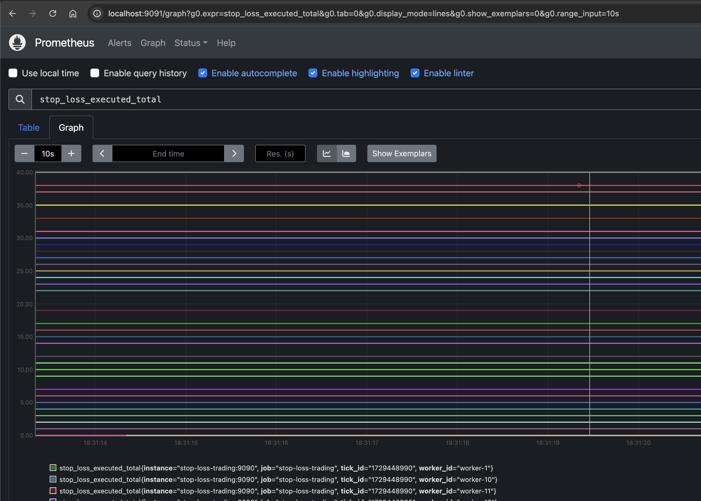

# Stop-Loss Trading System

This project is a stop-loss trading system that processes financial tick events and manages stop-loss orders using Redis and PostgreSQL. The system is designed to handle high-frequency trading data and execute stop-loss orders based on predefined criteria.

## Features

- **High-Frequency Tick Processing**: Efficiently processes tick events and updates order statuses.
- **Stop-Loss Order Management**: Automatically executes stop-loss orders when conditions are met.
- **Prometheus Metrics**: Monitors system performance and order processing metrics.
- **Scalable Architecture**: Supports multiple worker instances for concurrent processing.

## Prerequisites

- Docker
- Docker Compose

## Installation

1. **Clone the Repository**

   ```bash
   git clone git@github.com:trumboosahil/stop-loss-service.git
   cd stop-loss-trading
   ```
2. **Build and Run with Docker Compose**

   Ensure Docker and Docker Compose are installed, then run:

   ```bash
   docker compose up --build
   ```

   This command will build the Docker images and start the containers for your application, Redis, and PostgreSQL.

## Configuration

- **Environment Variables**: Configure your environment variables in the `docker compose.yml` file or use a `.env` file for sensitive information.

## Usage

- **API Endpoints**: The system provides RESTful API endpoints for placing and managing orders.
- **Metrics**: Access Prometheus metrics at `http://localhost:9090/metrics`.

## Architecture

- **Worker Service**: Processes tick events and manages stop-loss orders.
- **Redis**: Used for storing and managing order data.
- **PostgreSQL**: Stores order history and execution logs.
- **Prometheus**: Monitors system performance and metrics.




## Contributing

Contributions are welcome! Please fork the repository and submit a pull request for any improvements or bug fixes.

## License

This project is licensed under the MIT License.

## Contact

For questions or support, please contact [trumboosahil@gmail.com](mailto:trumboosahil@gmail.com).
